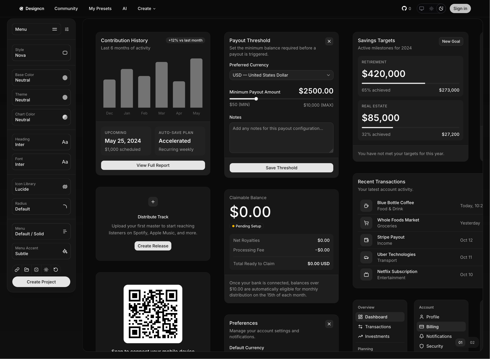

# Designcn

Build production-ready design systems and forms with a few clicks.

A modern shadcn/ui builder that helps you customize your design system, generate presets, and create production-ready forms without starting from scratch.

## Motivation

Design systems and forms are repetitive to set up well. You need consistent colors, typography, components, and validation, but getting there usually means a lot of manual boilerplate and trial-and-error. Designcn streamlines that process by guiding configuration, generating presets, and helping scaffold form experiences faster.

## Features

- Custom design system presets for colors, fonts, icons, themes, and component styles
- AI-assisted preset and form generation to avoid starting from a blank page
- Production-ready forms built with modern shadcn/ui components
- Type-safe architecture with Next.js, tRPC, Drizzle, Better Auth, and shared workspace packages

## License

This project is open source. See [LICENSE](./LICENSE) for details.
